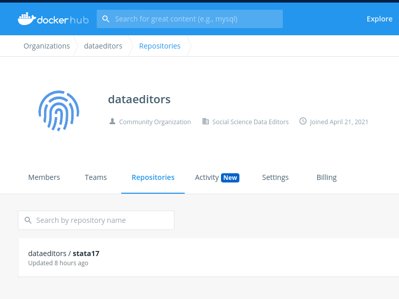

# Docker image basic Stata image

## Purpose

This Docker image is meant to isolate and stabilize that environment, and should be portable across
multiple operating system, as long as [Docker](https://docker.com) is available.

> To learn more about the use of containers for research reproducibility, see [Carpentries' docker-introduction](https://carpentries-incubator.github.io/docker-introduction/index.html). For commercial services running containers, see [codeocean.com](https://codeocean.com), [gigantum](https://gigantum.com/), or any of the cloud service providers. For an academic project using containers, see [Whole Tale](https://wholetale.org/).

> NOTE: The image created by these instructions contains binary code that is &copy; Stata. Permission was granted by Stata to Lars Vilhuber to post these images, without the license. A valid license is necessary to build and use these images. 

## Requirements

You need a Stata license to run the image. If rebuilding, may need Stata license to build the image.

## Dockerfile

The [Dockerfile](Dockerfile) contains the build instructions. A few things of note:


## Build

### Set up a few things

Set the `TAG` and `IMAGEID` accordingly. `VERSION` should be the Stata version.

```
VERSION=17
TAG=$(date +%F)
MYHUBID=dataeditors
MYIMG=stata${VERSION}
```

### Build the image

The Dockerfile relies on BuildKit syntax, for passing the license information.
Use the following if you just want to rebuild the Docker image (will re-use key cached information):

```
DOCKER_BUILDKIT=1 docker build  . \
  --secret id=statalic,src=stata.lic.${VERSION} \
  -t $MYHUBID/${MYIMG}:$TAG
```

or, if updating Stata, use the following, which will force an update through Stata:

```
DOCKER_BUILDKIT=1 docker build  . \
  --secret id=statalic,src=stata.lic.${VERSION} \
  --build-arg CACHEBUST=$(date +%s) \
  -t $MYHUBID/${MYIMG}:$TAG
```
> NOTE: Updating Stata actually doesn't work.

```
...
Removing intermediate container cb12e70b0154
 ---> 52e8f83a14f8
Successfully built 52e8f83a14f8
```

List your images:

```
docker images 
```
output:
```
REPOSITORY          TAG                 IMAGE ID            CREATED             SIZE
<none>              <none>              52e8f83a14f8        25 seconds ago      665MB
<none>              <none>              fb095c3f9ade        31 minutes ago      670MB
<none>              <none>              a919483dbe22        34 minutes ago      107MB
```

## Publish the image 

The resulting docker image can be uploaded to [Docker Hub](https://hub.docker.com/), if desired, or any other of the container registries. 


```
docker push $MYHUBID/${MYIMG}:$TAG
```

We can browse the provided images at [https://hub.docker.com/u/dataeditors](https://hub.docker.com/u/dataeditors):



## Using the image

Using a pre-built image on [Docker Hub](https://hub.docker.com/u/dataeditors) to run a program. 

> NOTE: because Stata is proprietary software, we need to mount a license file. 

> NOTE: We are using a working directory of "/code" here - check the [Dockerfile](Dockerfile) for the precise location.


For all the subsequent `docker run` commands, we will use similar environment variables:

```
VERSION=17
TAG=2021-06-09
MYHUBID=dataeditors
MYIMG=stata${VERSION}
STATALIC=$HOME/licenses/stata.lic.$VERSION
```

or

```
VERSION=17
TAG=2021-06-09
MYHUBID=dataeditors
MYIMG=stata${VERSION}
STATALIC=$(find $HOME/Dropbox/ -name stata.lic.$VERSION)
```

### To enter interactive stata

```
docker run -it --rm \
  -v ${STATALIC}:/usr/local/stata/stata.lic \
  -v $(pwd)/code:/code \
  -v $(pwd)/data:/data \
  -v $(pwd)/results:/results \
  $MYHUBID/${MYIMG}:${TAG}
```

### Aside: Using other container management software

The above builds and runs the container using Docker. While there is a free Community Edition of Docker, others may prefer to use one of the other container management software, such as [Podman](https://podman.io/) or [Singularity](https://sylabs.io/guides/latest/user-guide/). For instance, in Singularity, the following works:

```
singularity run  \
  -B ${STATALIC}/stata.lic.${VERSION}:/usr/local/stata/stata.lic \
  -B $(pwd)/code:/code \
  -B $(pwd)/data:/data \
  -B $(pwd)/results:/results \
  docker://$MYHUBID/${MYIMG}:${TAG}
```

### Running a program

The docker image has a `ENTRYPOINT` defined, which means it will act as if you were running Stata:


```
docker run -it --rm \
  -v ${STATALIC}/stata.lic.${VERSION}:/usr/local/stata/stata.lic \
  -v $(pwd)/code:/code \
  -v $(pwd)/data:/data \
  -v $(pwd)/results:/results \
  $MYHUBID/${MYIMG} -b program.do
```
Your program, of course, should reference the `/data` and `/results` directories:

```
global basedir "/"
global data "${basedir}data"
global results "${basedir}results"
// use "${data}/mydata.dta"
// graph export "${results}/figure1.png"
```

### Using the container to build a project-specific docker image

- Adjust the `setup.do` file - list all packages you want installed permanently. 
- Remember to have the `stata.lic.17` file available
- Start your Dockerfile with (adjust the tag)

```
# syntax=docker/dockerfile:1.2
FROM dataeditors/stata17:2021-06-09
# this runs your code 
COPY code/* /code/
COPY data/* /data/
RUN --mount=type=secret,id=statalic,dst=/usr/local/stata/stata.lic /usr/local/stata/stata-mp do /code/setup.do

USER statauser:stata
# run the master file
ENTRYPOINT ["stata-mp","/code/master.do"]
```

build, and then run this Docker image with

```
docker run --secret id=statalic,src=stata.lic.${VERSION} \
  -v $(pwd)/results:/results  \
  larsvilhuber/greatpaper:2021-06-08
```
and the results of running the code (in `code`) on the data (in `data`) will show up in the `results` folder which is local to your workstation.

## NOTE

This entire process could be automated, using [Travis-CI](https://docs.travis-ci.com/user/docker/#pushing-a-docker-image-to-a-registry) or [Github Actions](https://github.com/marketplace/actions/build-and-push-docker-images). Not done yet.
